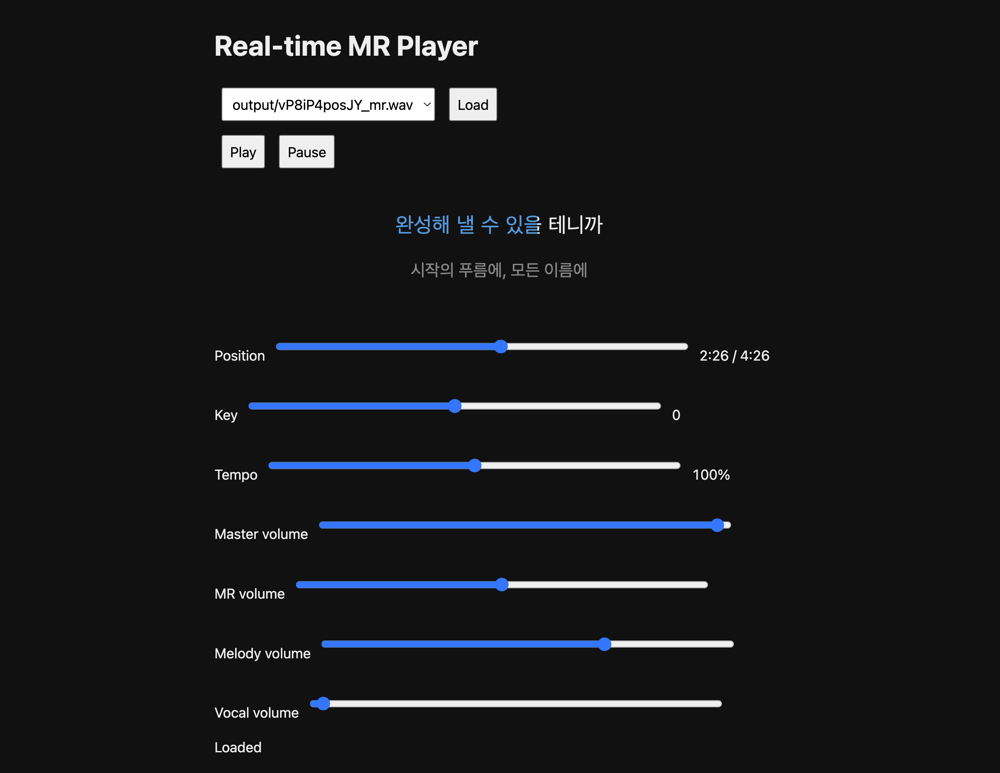

# Karaoke Lab

A small prototype for experimenting with features for a future karaoke app.

- Pitch extraction with GAME
- Melody guide generation
- Real-time key and tempo control
- MR, melody, and vocal volume control
- Minimal local web player



## Setup

```sh
git clone --recurse-submodules <repository-url>
```

Audio files, generated outputs, and build artifacts are not included.

### Source separation model

The Mel-Band RoFormer checkpoint is not included. Install
[`audio-separator`](https://github.com/nomadkaraoke/python-audio-separator) and download this exact model through it:

```text
MelBand Roformer | INSTV7 by Gabox
mel_band_roformer_instrumental_instv7_gabox.ckpt
```

Place the downloaded checkpoint and its accompanying
`config_mel_band_roformer_instrumental_gabox.yaml` under `models/audio-separator/`.

## Third-party projects

- [GAME](https://github.com/openvpi/GAME) (`GAME-1.0.3-medium-onnx` is included)
- [audio-separator](https://github.com/nomadkaraoke/python-audio-separator)
- [Rubber Band Library](https://github.com/breakfastquay/rubberband)
